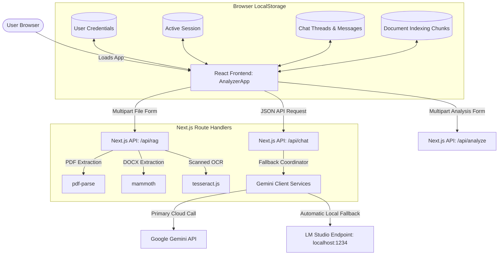

# CogniDoc Hub - Production-Ready AI Application

CogniDoc Hub is an advanced, full-stack AI platform built with **Next.js**, **React**, and **Google Gemini** (with local **LM Studio** fallback). Originally an adaptive document analyzer, it has been expanded into a production-grade multimodal assistant supporting:
1. **💬 Multi-Mode Conversations**: General Chat, File & Video Query, Medical AI, and Legal Document Guide.
2. **📁 Document Vault (Local RAG)**: Client-Server hybrid document chunking and TF-IDF semantic keyword search with interactive citations.
3. **📷 Multimodal Uploads**: Supporting PDF, DOCX, TXT, images (with OCR), audio, and video files.
4. **🔒 Mock Authentication**: Multi-account Sign In & Sign Up saved directly in browser LocalStorage.
5. **💾 Conversational Memory**: Thread-based history persistence in browser LocalStorage.
6. **📝 Documents Exporters**: Instantly download chat logs as Markdown (`.md`) or Word Document (`.doc`) files.

---

## System Architecture

The following diagram outlines the modular architecture of the CogniDoc Hub:



---

## Features

* **AI Provider Coordinator & Fallback**: Change your AI provider in the UI:
    * **OpenAI (ChatGPT API)**: Uses `OPENAI_API_KEY` and `OPENAI_MODEL` (defaults to `gpt-4o-mini`).
    * **Auto**: Prefers OpenAI when `OPENAI_API_KEY` is configured, then Gemini, with LM Studio as the final fallback.
  * **Gemini Cloud AI**: Queries Google Gemini directly.
  * **LM Studio (Local LLM)**: Queries your local offline model (e.g. Llama 3).
* **RAG Citations viewer**: Clickable citations (e.g. `📄 agreement.docx [ch 3]`) open a drawer showing the exact text chunk extracted from the source document.
* **Full-Screen Workspace**: Toggle a workspace header button to collapse the sidebar for a focus-oriented full-screen chat interface.
* **Word & Markdown Exporters**: Export formatted transcripts locally.

---

## Installation & Setup

### Prerequisites
* **Node.js** Version `^20.16.0`, `^22.3.0`, or `>=24` (required by the installed `pdf-parse` version).

### 1. Create Your Local Environment File
Copy the example environment template to `.env.local` (PowerShell: `Copy-Item .env.example .env.local`):
```bash
cp .env.example .env.local
```

### 2. Configure Providers
Open `.env.local` and set your OpenAI API key. Keep the key private; `.env.local` is ignored by Git. Restart the dev server after changing environment variables.
```env
# OpenAI API (used by the default provider selection)
OPENAI_API_KEY=your_openai_api_key_here
OPENAI_MODEL=gpt-4o-mini

# Optional: Gemini API
GEMINI_API_KEY=your_gemini_api_key_here
GEMINI_MODEL=gemini-2.0-flash

# Optional: LM Studio local server
USE_LOCAL_LLM=true
LM_STUDIO_BASE_URL=http://127.0.0.1:1234/v1
LM_STUDIO_MODEL=llama-3.2-3b-instruct
```

Use the **AI Provider** menu in the app header to switch between **OpenAI API** and **LM Studio Local**. LM Studio must be running with a model loaded before selecting it. The app remembers your provider choice in the browser.

### 3. Run the App
Install all dependencies and start the development server:
```bash
npm install
npm run dev
```

Open [http://localhost:3000](http://localhost:3000) to access the application.

---

## Verification & Testing
To compile an optimized production build:
```bash
npm run build
```
The routes will build successfully:
* `/` (Static Page)
* `/api/analyze` (Dynamic Server Route)
* `/api/chat` (Dynamic Server Route)
* `/api/rag` (Dynamic Server Route)
